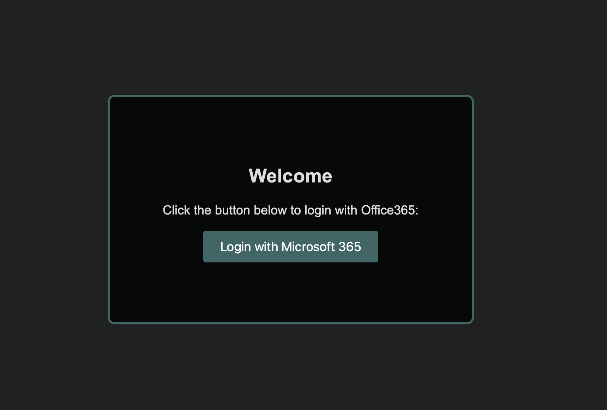
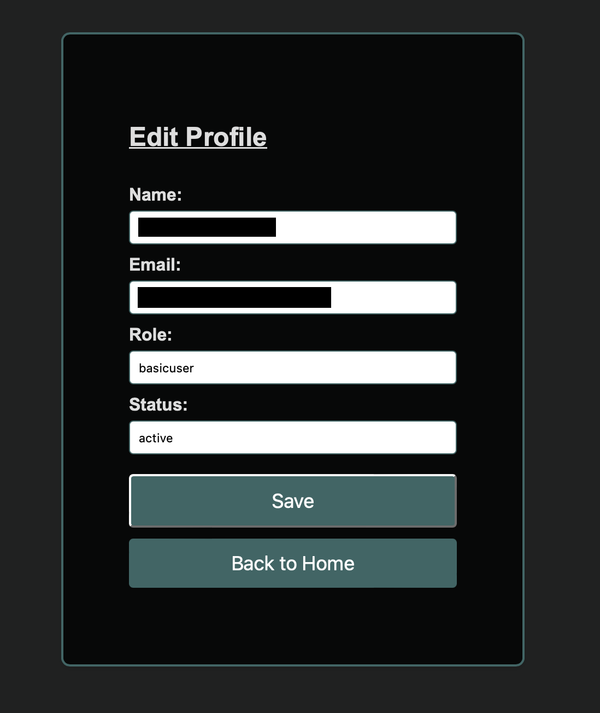

The website is hosted on Microsoft Azure and uses Office 365 authentication via Microsoft Graph API. Upon login, users are assigned a role as either admin or basic user.

Welcome Page

Authentication & User Roles
  - Office 365 Login: Users authenticate using their Microsoft credentials.
  - Role Assignment:
      Admins: Have full user management privileges.
      Basic Users: Have limited access with no administrative controls.

Basic User Views

Admin Functionalities
  - Admins have access to a user management dashboard where they can:
    
  - View all logged-in users, including their status (active/inactive).
  - Change user status (activate or deactivate accounts).
  - Delete users, ensuring they cannot log back in.
  - Promote basic users to admin roles.

System Implementation

  - Backend: Flask with SQLAlchemy for database management.
  - Frontend: Likely HTML/CSS/JavaScript, potentially using Flask templates or React.
  - Authentication: OAuth2.0 via Microsoft Graph API.
  - Database Schema (SQLAlchemy Models):
  - Users Table: Stores user information, roles, and active status.

Security Considerations

  - Role-Based Access Control (RBAC) ensures only admins can manage users.
  - OAuth2.0 Authentication via Microsoft for secure login.
  - Data Protection: Proper encryption and security measures for user data.

